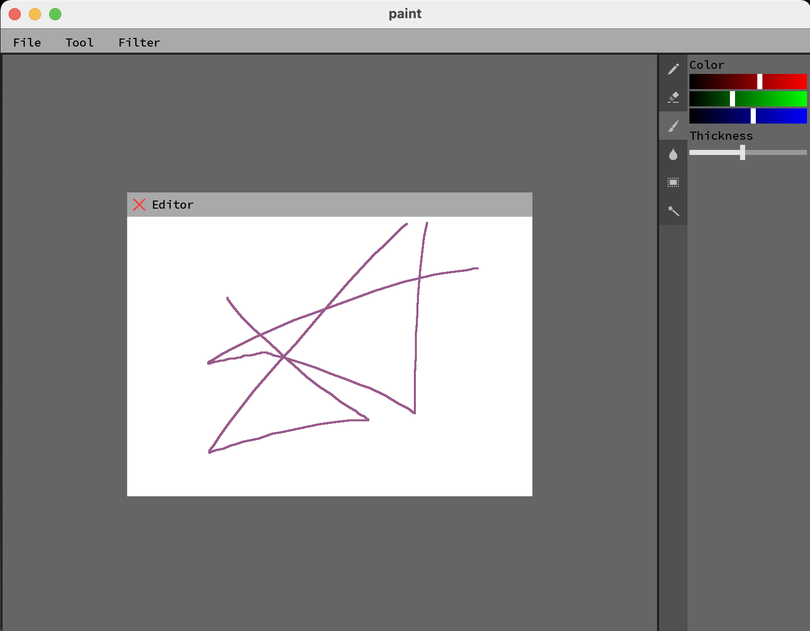

# Simple GUI library overview #

The library provides  
- base classes for creating widgets;
- mechanism for linking widgets and logic called signal & slots;
- ability to extend the application using plugins

# Example of usage #

Paint written on the basis of this library.

